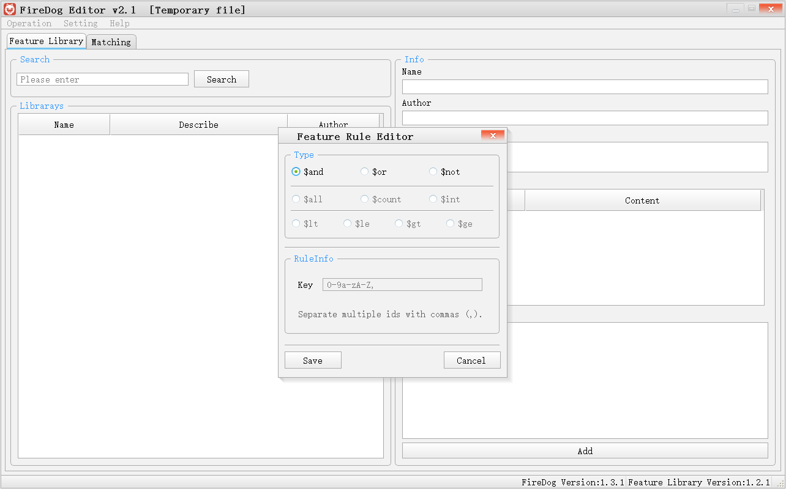
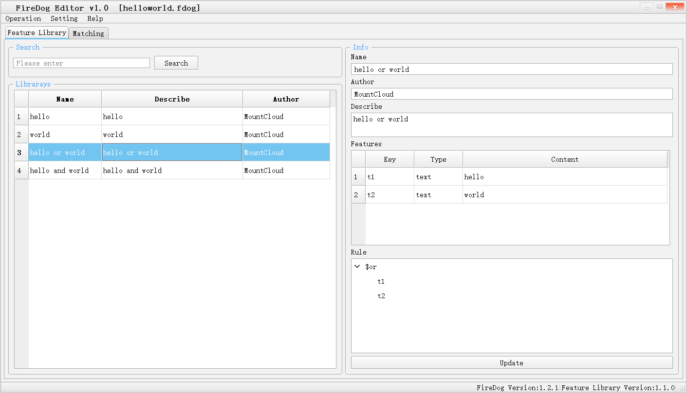
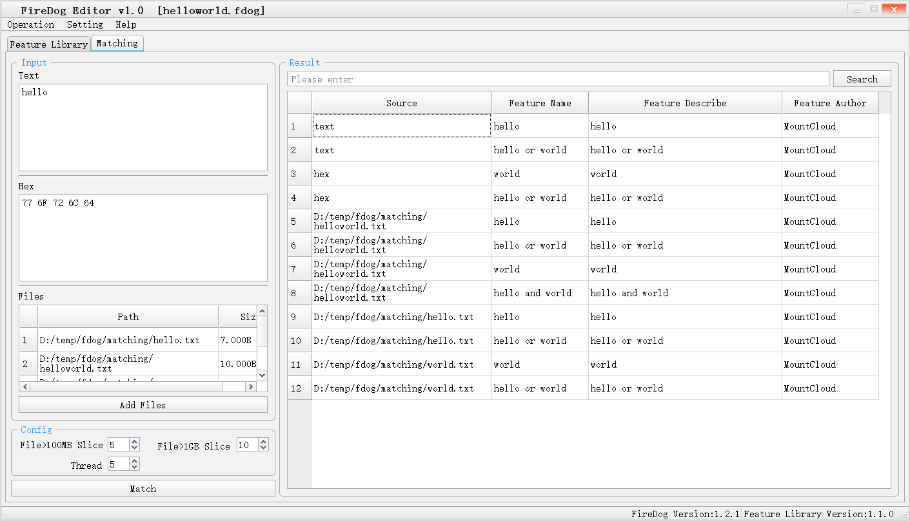
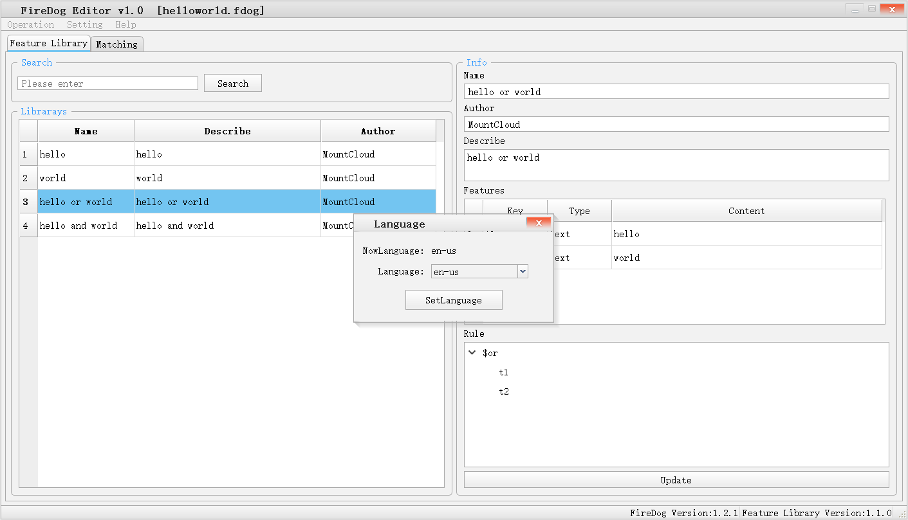

# FireDog
开源跨平台轻量级病毒特征检测引擎。Open source cross-platform lightweight virus signature detection engine.

在Releases下载最新版本，跟路径有个demo文件夹，可以参考，并且READEME.txt中也有说明。

# 语言 Language
C++ 11

# LICENSE

是你们喜欢的：MIT License.

让我们搞起来！

It's what you like:MIT License.

Let's do it!

# 交流 contact us

QQGroup: 337571436

Email: mountcloud@outlook.com

# 简介 Introduction

提供一个轻量级的特征检测引擎，支持自定义扩展特征库，等有时间再画引擎架构图。

Provide a lightweight feature detection engine, support custom extended feature libraries, and draw engine architecture diagrams when you have time.

# 特征库编辑器下载地址 Feature Library Editor download

https://github.com/MountCloud/FireDog/releases

# 说明

## 特征说明 Feature Description

```
key：代表这个特征的标识。
hex：hex是以二进制形式进行匹配的二进制数据，允许模糊匹配如：0F ?0 A? ??。
text：以文本形式匹配的关键字。

key: The identifier representing this feature.
hex: hex is binary data that is matched in binary form, allowing fuzzy matching such as: 0F ?0 A? ??.
text: The keyword to match in text form.
```
## 规则说明 Rules Description

```
$and：[规则数组] 并运算，只有子规则结果全部为true(通过)时，结果为true(通过)，如果有一条子规则结果为false(不通过)，则结果为false(不通过)。
$or：[规则数组] 或运算，有一条子规则结果全部为true(通过)时，结果为true(通过)，如果全部子规则结果为false(不通过)，则结果为false(不通过)。
$not：[规则数组] 非运算，只有子规则结果全部为false(不通过)时，结果为true(通过)，如果有一条子规则结果为true(通过)，则结果为false(不通过)。意思就是如果$not的子规则是$lt($count(key1),$int(5))=$not（key1出现次数小于5）=不能（key1出现的次数小于5）=key1出现的次数需要大于5

$all：[字符串数组] 表示一组key必须至少全部出现1次。$all(key1,key2)表示key1和key2必须至少都出现一次。
$count：*数字规则*[字符串数组] 表示统计key出现的次数。$count(key1,key2)就是统计key1和key2出现的次数。
$int：*数字规则*[数字类型] 表示一个数字。$int(1)代表数字1

$lt：*比较规则*，小于比较，使用两个*数字规则*进行比较，数字规则1 < 数字规则2，则为true（通过）。
$le：*比较规则*，小于等于比较，使用两个*数字规则*进行比较，数字规则1 <= 数字规则2，则为true（通过）。
$gt：*比较规则*，大于比较，使用两个*数字规则*进行比较，数字规则1 > 数字规则2，则为true（通过）。
$ge：*比较规则*，大于等于比较，使用两个*数字规则*进行比较，数字规则1 >= 数字规则2，则为true（通过）。


$and: [rule array] Parallel operation, only when the sub-rule results are all true (pass), the result is true (pass), if there is a sub-rule result is false (fail), the result is false (fail) .
$or: [rule array] OR operation, when one sub-rule result is all true (pass), the result is true (pass), if all sub-rule results are false (fail), the result is false (fail) .
$not: [rule array] Non-operation, only when the sub-rule results are all false (fail), the result is true (pass), if there is a sub-rule result is true (pass), the result is false (fail) . It means that if the sub-rule of $not is $lt($count(key1), $int(5)) = $not (the number of occurrences of key1 is less than 5) = cannot (the number of occurrences of key1 is less than 5) = the number of occurrences of key1 needs to be greater than 5

$all: [string array] Indicates that a set of keys must all appear at least once. $all(key1,key2) means that both key1 and key2 must appear at least once.
$count: *Number rule*[String array] Indicates the number of times the key appears. $count(key1,key2) is to count the number of occurrences of key1 and key2.
$int: *Number Rule* [Number Type] Represents a number. $int(1) represents the number 1

$lt: *comparison rule*, less than comparison, use two *number rule* for comparison, number rule 1 < number rule 2, true (pass).
$le: *comparison rule*, less than or equal comparison, use two *number rule* for comparison, number rule 1 <= number rule 2, it is true (pass).
$gt: *comparison rule*, greater than comparison, use two *number rule* for comparison, number rule 1 > number rule 2, it is true (pass).
$ge: *comparison rule*, greater than or equal to comparison, use two *number rule* for comparison, number rule 1 >= number rule 2, it is true (pass).
```

# 更新日志 Update log

# v1.3.1

```
FireDog Version: v1.3.1
FireDog Editor Version: v2.1
Feature Libraray Version: v1.2.1

1：重构规则引擎，支持多种逻辑运算，支持多种统计运算，支持多种比较运算。
2：重构特征库格式，从json改用yaml（json确实看起来不好看）。
3：更改特征匹配逻辑，将字节匹配与校验匹配结果拆分。
4：编辑器适配新的规则引擎和特征库格式。

1: Refactor the rule engine to support multiple logical operations, multiple statistical operations, and multiple comparison operations.
2: Refactor the feature library format and use yaml instead of json (json does not look good).
3: Change the feature matching logic to split the byte matching and check matching results.
4: The editor adapts to the new rule engine and signature library format.
```

## v1.3.1 界面GUI
### 规则配置GUI Rule Configuration GUI



# v1.2.1

```
FireDog Version: v1.2.1
FireDog Editor Version: v1.0
Feature Libraray Version: v1.1.0

1：单资源匹配返回单条匹配特征改为返回多条匹配特征，这样单个文件允许被检测出多个特征。
2：【革命性更新】推出“特征库编辑器 FireDogEditor”，可以使用界面对特征库进行修改，并且进行测试，该编辑器支持国际化。

1: Single resource matching returns a single matching feature instead of returning multiple matching features, so that a single file allows multiple features to be detected.
2: [Revolutionary update] Launched the "feature library editor FireDogEditor", you can use the interface to modify and test the feature library, the editor supports internationalization.
```

## v1.2.1 界面GUI
### 特征库配置界面 Feature library configuration gui


### 测试界面 Test gui


### 设置语言界面 Language setting gui



# v1.1.0

```
1：重构特征库格式，特征库更加合理。
2：升级hex检测，支持通配符，例如：6D ?? ?5 6? [73-75] [41-5A,61-7A] 6C 6F 75 64
3：加入轻量级规则引擎/rule/rule.h，所以特征库支持使用规则进行条件匹配，语法类似mongodb的查询。

1: Refactor the format of the feature library to make the feature library more reasonable.
2: Upgrade hex detection to support wildcards, for example: 6D ?? ?5 6? [73-75] [41-5A,61-7A] 6C 6F 75 64
3: Add the lightweight rule engine /rule/rule.h, so the signature database supports the use of rules for condition matching, and the syntax is similar to mongodb query.
```

# v1.0.0 

```
支持hex、md5、text类型检测。
Support hex, md5, text type detection.
```

# 使用 Use

## Step 1: download
```
git clone https://github.com/MountCloud/FireDog.git
```
## Step 2: include
```
include FireDog
```
## Step 3: Example

```
look FireDogEditor/matchthread.h and FireDogEditor/matchthread.cpp
```
